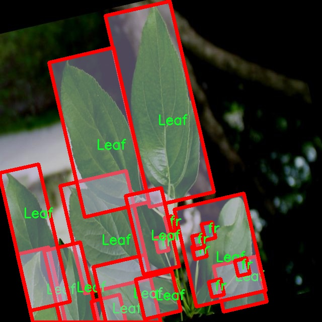

# 植物病害图像分割系统： yolov8-seg-C2f-MSBlock

### 1.研究背景与意义

[参考博客](https://gitee.com/YOLOv8_YOLOv11_Segmentation_Studio/projects)

[博客来源](https://kdocs.cn/l/cszuIiCKVNis)

研究背景与意义

随着全球气候变化和农业生产方式的转变，植物病害的发生频率和范围逐渐增加，给农业生产带来了严峻的挑战。植物病害不仅影响作物的生长和产量，还可能导致食品安全问题，进而影响到人类的生活质量。因此，及时、准确地识别和诊断植物病害，成为现代农业中亟待解决的重要课题。传统的植物病害识别方法多依赖于人工观察和经验判断，存在着主观性强、效率低下等问题，难以满足大规模农业生产的需求。随着计算机视觉和深度学习技术的迅猛发展，基于图像处理的植物病害识别系统逐渐成为研究的热点。

在众多深度学习模型中，YOLO（You Only Look Once）系列模型因其高效的实时目标检测能力而受到广泛关注。YOLOv8作为该系列的最新版本，进一步提升了模型的检测精度和速度，适用于复杂的农业环境。然而，现有的YOLOv8模型在处理植物病害图像时，仍然面临着一些挑战，例如背景复杂、病害特征不明显以及多类别病害的相互干扰等。因此，基于改进YOLOv8的植物病害图像分割系统的研究显得尤为重要。

本研究将基于PDD（Plant Disease Dataset）数据集进行深入探索。该数据集包含1300幅图像，涵盖了叶片、土壤、症状、果实和手等五个类别，能够为植物病害的多样性提供丰富的样本支持。通过对这些图像进行实例分割，不仅可以准确识别出病害的具体位置，还能有效区分不同类别的植物病害，从而为后续的病害分析和处理提供科学依据。尤其是在农业生产中，针对不同病害的及时处理和管理能够显著提高作物的抗病能力和产量。

本研究的意义在于，通过改进YOLOv8模型，提升植物病害图像分割的精度和效率，为农业生产提供一种新的技术手段。同时，研究成果将为植物病害的智能识别和精准管理奠定基础，推动农业数字化转型进程。此外，基于实例分割的植物病害识别系统，能够为农民和农业管理者提供实时的病害监测和预警，帮助他们在第一时间采取相应的防治措施，降低病害对作物的影响。

综上所述，基于改进YOLOv8的植物病害图像分割系统的研究，不仅具有重要的理论价值，还有助于解决实际农业生产中的难题，推动农业科技的进步与发展。通过深入分析和应用该系统，期望能够为实现可持续农业发展贡献一份力量。

### 2.图片演示


注意：本项目提供完整的训练源码数据集和训练教程,由于此博客编辑较早,暂不提供权重文件（best.pt）,需要按照6.训练教程进行训练后实现上图效果。

### 3.视频演示

[3.1 视频演示](https://www.bilibili.com/video/BV1bkUZY3EXo/)

### 4.数据集信息

##### 4.1 数据集类别数＆类别名

nc: 5
names: ['Leaf', 'Soil', 'Symptoms', 'fr', 'hand']


##### 4.2 数据集信息简介

数据集信息展示

在本研究中，我们使用了名为“PDD”的数据集，以支持改进YOLOv8-seg的植物病害图像分割系统的训练与评估。该数据集专注于植物病害的视觉识别，尤其是在农业领域中，能够为农作物的健康监测和病害预警提供重要的技术支持。PDD数据集包含五个主要类别，分别为“Leaf”（叶片）、“Soil”（土壤）、“Symptoms”（症状）、“fr”（果实）和“hand”（手），这些类别涵盖了植物生长环境及其病害表现的多个方面。

首先，叶片（Leaf）类别是数据集中最为关键的部分之一。叶片是植物进行光合作用的主要器官，任何病害的发生往往首先体现在叶片上。因此，准确识别叶片的健康状态和病害症状对于及时采取防治措施至关重要。该类别的图像数据不仅包括健康叶片的样本，还涵盖了不同病害类型对叶片造成的影响，例如斑点、枯萎和变色等。

其次，土壤（Soil）类别的引入为植物病害的研究提供了更为全面的视角。土壤是植物生长的基础，其健康状况直接影响植物的生长和抗病能力。通过分析土壤的特征，我们可以更好地理解植物病害的发生机制。因此，PDD数据集中包含了不同土壤条件下的图像，帮助模型学习如何从土壤的状态推测植物的健康状况。

症状（Symptoms）类别则专注于植物病害表现出的具体症状。这一类别的图像数据涵盖了多种植物病害的表现形式，包括但不限于叶片的黄化、枯萎、斑点等。通过对这些症状的有效识别，YOLOv8-seg模型能够快速、准确地判断植物的健康状况，从而为农民提供及时的病害预警。

在数据集中，果实（fr）类别同样扮演着重要角色。果实的健康状况不仅影响作物的产量和品质，也直接关系到农民的经济收益。通过对果实的图像进行分析，模型能够识别出病害对果实的影响，从而为果实的采摘和销售提供科学依据。

最后，手（hand）类别的引入则为数据集增添了人机交互的维度。手的图像通常用于表示人工检测和处理植物病害的过程。这一类别的存在不仅能够帮助模型理解人类在植物病害管理中的作用，还能为后续的自动化监测和干预提供参考。

综上所述，PDD数据集的设计充分考虑了植物病害的多样性和复杂性，涵盖了植物生长的各个方面。通过对这五个类别的深入分析与学习，改进后的YOLOv8-seg模型将能够在植物病害图像分割任务中表现出更高的准确性和鲁棒性，为农业生产提供强有力的技术支持。数据集的多样性和丰富性为模型的训练提供了坚实的基础，使其能够在实际应用中更好地应对各种复杂的场景和挑战。





### 5.项目依赖环境部署教程（零基础手把手教学）

[5.1 环境部署教程链接（零基础手把手教学）](https://www.bilibili.com/video/BV1jG4Ve4E9t/?vd_source=bc9aec86d164b67a7004b996143742dc)


[5.2 安装Python虚拟环境创建和依赖库安装视频教程链接（零基础手把手教学）](https://www.bilibili.com/video/BV1nA4VeYEze/?vd_source=bc9aec86d164b67a7004b996143742dc)

### 6.手把手YOLOV8-seg训练视频教程（零基础手把手教学）

[6.1 手把手YOLOV8-seg训练视频教程（零基础小白有手就能学会）](https://www.bilibili.com/video/BV1cA4VeYETe/?vd_source=bc9aec86d164b67a7004b996143742dc)


按照上面的训练视频教程链接加载项目提供的数据集，运行train.py即可开始训练



     Epoch   gpu_mem       box       obj       cls    labels  img_size
     1/200     0G   0.01576   0.01955  0.007536        22      1280: 100%|██████████| 849/849 [14:42<00:00,  1.04s/it]
               Class     Images     Labels          P          R     mAP@.5 mAP@.5:.95: 100%|██████████| 213/213 [01:14<00:00,  2.87it/s]
                 all       3395      17314      0.994      0.957      0.0957      0.0843

     Epoch   gpu_mem       box       obj       cls    labels  img_size
     2/200     0G   0.01578   0.01923  0.007006        22      1280: 100%|██████████| 849/849 [14:44<00:00,  1.04s/it]
               Class     Images     Labels          P          R     mAP@.5 mAP@.5:.95: 100%|██████████| 213/213 [01:12<00:00,  2.95it/s]
                 all       3395      17314      0.996      0.956      0.0957      0.0845

     Epoch   gpu_mem       box       obj       cls    labels  img_size
     3/200     0G   0.01561    0.0191  0.006895        27      1280: 100%|██████████| 849/849 [10:56<00:00,  1.29it/s]
               Class     Images     Labels          P          R     mAP@.5 mAP@.5:.95: 100%|███████   | 187/213 [00:52<00:00,  4.04it/s]
                 all       3395      17314      0.996      0.957      0.0957      0.0845


### 7.50+种全套YOLOV8-seg创新点加载调参实验视频教程（一键加载写好的改进模型的配置文件）

[7.1 50+种全套YOLOV8-seg创新点加载调参实验视频教程（一键加载写好的改进模型的配置文件）](https://www.bilibili.com/video/BV1Hw4VePEXv/?vd_source=bc9aec86d164b67a7004b996143742dc)

### YOLOV8-seg算法简介

原始YOLOV8-seg算法原理

YOLOv8-seg算法是Ultralytics于2023年推出的一种新型目标检测与分割模型，旨在提升计算机视觉领域的性能与效率。作为YOLO系列的最新版本，YOLOv8-seg不仅继承了前几代模型的优点，还通过引入新的网络结构和训练策略，进一步优化了目标检测和实例分割的效果。该算法的设计理念围绕着三个核心部分展开：Backbone、Neck和Head，这些部分相互协作，共同构成了YOLOv8-seg的整体架构。

在Backbone部分，YOLOv8-seg采用了一系列卷积和反卷积层来提取图像特征。与以往的YOLO版本不同，YOLOv8-seg引入了C2模块作为基本构成单元，这种模块通过残差连接和瓶颈结构的结合，不仅有效减小了网络的参数量，还提升了模型的性能。具体而言，Backbone由五个CBS模块、四个C2f模块和一个快速空间金字塔池化（SPPF）模块组成。CBS模块负责基本的特征提取，而C2f模块则通过特征的分离与连接，进一步增强了网络的表达能力。SPPF模块的引入则显著提高了模型的计算速度，使得YOLOv8-seg在处理高分辨率图像时依然能够保持高效。

接下来的Neck部分则采用了多尺度特征融合技术，旨在将来自Backbone不同阶段的特征图进行有效融合。这一过程不仅有助于捕捉不同尺度目标的信息，还显著提高了目标检测的性能和鲁棒性。YOLOv8-seg通过引入PAN-FPN（路径聚合网络-特征金字塔网络）结构，使得特征融合的过程更加高效和灵活。该结构能够有效地将高层语义信息与低层细节信息结合，确保在进行目标检测时，模型能够充分利用不同层次的特征，从而提高检测的准确性。

最后，Head部分负责最终的目标检测和分类任务。YOLOv8-seg设有三个检测头，分别用于处理不同尺寸的目标信息。这些检测头包含了一系列卷积层和反卷积层，旨在生成最终的检测结果。与以往的YOLO版本相比，YOLOv8-seg在检测头的设计上进行了创新，采用了Anchor-Free检测方式，极大地简化了目标检测的过程。通过解耦头结构，YOLOv8-seg能够在不依赖于先验框的情况下，直接预测目标的位置和类别，从而提高了模型的灵活性和适应性。

值得一提的是，YOLOv8-seg在损失函数的设计上也进行了改进，采用了CloU损失函数。这一损失函数不仅考虑了目标的分类损失，还综合了目标位置的回归损失，使得模型在训练过程中能够更好地平衡这两者之间的关系，从而提升了整体的检测性能。

YOLOv8-seg的多样化网络结构使其能够适应不同的应用场景。该算法提供了五种不同规模的网络结构，包括YOLOv8n、YOLOv8s、YOLOv8m、YOLOv8l和YOLOv8x，用户可以根据具体需求选择合适的模型。这些不同规模的网络在Backbone的层数和残差块的数量上有所不同，但其基本原理和结构设计保持一致。这种灵活性使得YOLOv8-seg在处理不同复杂度的任务时，能够有效地平衡速度与精度之间的关系。

在实际应用中，YOLOv8-seg展现出了卓越的性能，尤其是在复杂场景下的目标检测与分割任务中。以苹果采摘为例，YOLOv8-seg的视觉识别能力能够自动检测和定位苹果，为自动采摘机器人提供实时的目标信息。这一应用不仅提高了采摘效率，还为农业自动化的发展提供了新的思路。

总的来说，YOLOv8-seg算法通过其创新的网络结构和高效的训练策略，推动了目标检测与分割技术的发展。无论是在理论研究还是实际应用中，YOLOv8-seg都展现出了其独特的优势，成为计算机视觉领域的一项重要突破。随着技术的不断进步，YOLOv8-seg有望在更多的领域中发挥其潜力，为人们的生活带来更多便利。


### 9.系统功能展示（检测对象为举例，实际内容以本项目数据集为准）

图9.1.系统支持检测结果表格显示

  图9.2.系统支持置信度和IOU阈值手动调节

  图9.3.系统支持自定义加载权重文件best.pt(需要你通过步骤5中训练获得)

  图9.4.系统支持摄像头实时识别

  图9.5.系统支持图片识别

  图9.6.系统支持视频识别

  图9.7.系统支持识别结果文件自动保存

  图9.8.系统支持Excel导出检测结果数据


### 10.50+种全套YOLOV8-seg创新点原理讲解（非科班也可以轻松写刊发刊，V11版本正在科研待更新）

#### 10.1 由于篇幅限制，每个创新点的具体原理讲解就不一一展开，具体见下列网址中的创新点对应子项目的技术原理博客网址【Blog】：


[10.1 50+种全套YOLOV8-seg创新点原理讲解链接](https://gitee.com/qunmasj/good)

#### 10.2 部分改进模块原理讲解(完整的改进原理见上图和技术博客链接)【如果此小节的图加载失败可以通过CSDN或者Github搜索该博客的标题访问原始博客，原始博客图片显示正常】

### YOLOv8简介


由上图可以看出，C2中每个BottlNeck的输入Tensor的通道数channel都只是上一级的0.5倍，因此计算量明显降低。从另一方面讲，梯度流的增加，t也能够明显提升收敛速度和收敛效果。
C2i模块首先以输入tensor(n.c.h.w)经过Conv1层进行split拆分，分成两部分(n,0.5c,h,w)，一部分直接经过n个Bottlenck，另一部分经过每一操作层后都会以(n.0.5c,h,w)的尺寸进行Shortcut，最后通过Conv2层卷积输出。也就是对应n+2的Shortcut(第一层Conv1的分支tensor和split后的tensor为2+n个bottenlenneck)。
#### Neck
YOLOv8的Neck采用了PANet结构，如下图所示。

Backbone最后SPPF模块(Layer9)之后H、W经过32倍下采样，对应地Layer4经过8倍下采样，Layer6经过16倍下采样。输入图片分辨率为640*640，得到Layer4、Layer6、Layer9的分辨率分别为80*80、40*40和20*20。
Layer4、Layer6、Layer9作为PANet结构的输入，经过上采样，通道融合，最终将PANet的三个输出分支送入到Detect head中进行Loss的计算或结果解算。
与FPN(单向，自上而下)不同的是，PANet是一个双向通路网络，引入了自下向上的路径，使得底层信息更容易传递到顶层。
#### Head
Head部分相比Yolov5改动较大，直接将耦合头改为类似Yolo的解耦头结构(Decoupled-Head)，将回归分支和预测分支分离，并针对回归分支使用了Distribution Focal Loss策略中提出的积分形式表示法。之前的目标检测网络将回归坐标作为一个确定性单值进行预测，DFL将坐标转变成一个分布。


### LSKNet的架构
该博客提出的结构层级依次为：

LSK module（大核卷积序列+空间选择机制） < LSK Block （LK Selection + FFN）<LSKNet（N个LSK Block）


#### LSK 模块

LSK Block
LSKNet 是主干网络中的一个可重复堆叠的块（Block），每个LSK Block包括两个残差子块，即大核选择子块（Large Kernel Selection，LK Selection）和前馈网络子块（Feed-forward Network ，FFN），如图8。LK Selection子块根据需要动态地调整网络的感受野，FFN子块用于通道混合和特征细化，由一个全连接层、一个深度卷积、一个 GELU 激活和第二个全连接层组成。

LSK module（LSK 模块，图4）由一个大核卷积序列（large kernel convolutions）和一个空间核选择机制（spatial kernel selection mechanism）组成，被嵌入到了LSK Block 的 LK Selection子块中。

#### Large Kernel Convolutions
因为不同类型的目标对背景信息的需求不同，这就需要模型能够自适应选择不同大小的背景范围。因此，作者通过解耦出一系列具有大卷积核、且不断扩张的Depth-wise 卷积，构建了一个更大感受野的网络。

具体地，假设序列中第i个Depth-wise 卷积核的大小为 ，扩张率为 d，感受野为 ，它们满足以下关系：


卷积核大小和扩张率的增加保证了感受野能够快速增大。此外，我们设置了扩张率的上限，以保证扩张卷积不会引入特征图之间的差距。


Table2的卷积核大小可根据公式（1）和（2）计算，详见下图：


这样设计的好处有两点。首先，能够产生具有多种不同大小感受野的特征，便于后续的核选择；第二，序列解耦比简单的使用一个大型卷积核效果更好。如上图表2所示，解耦操作相对于标准的大型卷积核，有效地将低了模型的参数量。

为了从输入数据  的不同区域获取丰富的背景信息特征，可采用一系列解耦的、不用感受野的Depth-wise 卷积核：


其中，是卷积核为 、扩张率为  的Depth-wise 卷积操作。假设有个解耦的卷积核，每个卷积操作后又要经过一个的卷积层进行空间特征向量的通道融合。


之后，针对不同的目标，可基于获取的多尺度特征，通过下文中的选择机制动态选择合适的卷积核大小。

这一段的意思可以简单理解为：

把一个大的卷积核拆成了几个小的卷积核，比如一个大小为5，扩张率为1的卷积核加上一个大小为7，扩张率为3的卷积核，感受野为23，与一个大小为23，扩张率为1的卷积核的感受野是一样的。因此可用两个小的卷积核替代一个大的卷积核，同理一个大小为29的卷积核也可以用三个小的卷积代替（Table 2），这样可以有效的减少参数，且更灵活。

将输入数据依次通过这些小的卷积核（公式3），并在每个小的卷积核后面接上一个1×1的卷积进行通道融合（公式4）。

#### Spatial Kernel Selection
为了使模型更关注目标在空间上的重点背景信息，作者使用空间选择机制从不同尺度的大卷积核中对特征图进行空间选择。

首先，将来自于不同感受野卷积核的特征进行concate拼接，然后，应用通道级的平均池化和最大池化提取空间关系，其中， 和  是平均池化和最大池化后的空间特征描述符。为了实现不同空间描述符的信息交互，作者利用卷积层将空间池化特征进行拼接，将2个通道的池化特征转换为N个空间注意力特征图，之后，将Sigmoid激活函数应用到每一个空间注意力特征图，可获得每个解耦的大卷积核所对应的独立的空间选择掩膜，又然后，将解耦后的大卷积核序列的特征与对应的空间选择掩膜进行加权处理，并通过卷积层进行融合获得注意力特征 ，最后LSK module的输出可通过输入特征  与注意力特征  的逐元素点成获得，公式对应于结构图上的操作如下：


### 11.项目核心源码讲解（再也不用担心看不懂代码逻辑）

#### 11.1 ultralytics\utils\instance.py

以下是对代码的逐文件分析，保留了最核心的部分，并对代码进行了详细的中文注释：

```python
# Ultralytics YOLO 🚀, AGPL-3.0 license

import numpy as np
from collections import abc
from itertools import repeat
from numbers import Number
from typing import List

# 定义一个函数，用于将输入转换为n元组
def _ntuple(n):
    """从PyTorch内部实现，解析输入为n元组。"""
    def parse(x):
        """解析边界框格式，支持XYWH和LTWH。"""
        return x if isinstance(x, abc.Iterable) else tuple(repeat(x, n))
    return parse

# 定义将输入转换为2元组和4元组的函数
to_2tuple = _ntuple(2)
to_4tuple = _ntuple(4)

# 定义边界框格式
_formats = ['xyxy', 'xywh', 'ltwh']

class Bboxes:
    """
    处理边界框的类，支持多种格式（'xyxy', 'xywh', 'ltwh'）。
    属性:
        bboxes (numpy.ndarray): 存储边界框的二维numpy数组。
        format (str): 边界框的格式（'xyxy', 'xywh', 或 'ltwh'）。
    """

    def __init__(self, bboxes, format='xyxy') -> None:
        """初始化Bboxes类，指定边界框数据的格式。"""
        assert format in _formats, f'无效的边界框格式: {format}, 必须是 {_formats} 中的一种'
        bboxes = bboxes[None, :] if bboxes.ndim == 1 else bboxes
        assert bboxes.ndim == 2
        assert bboxes.shape[1] == 4
        self.bboxes = bboxes
        self.format = format

    def convert(self, format):
        """将边界框格式从一种类型转换为另一种。"""
        assert format in _formats, f'无效的边界框格式: {format}, 必须是 {_formats} 中的一种'
        if self.format == format:
            return
        # 根据当前格式和目标格式选择转换函数
        func = self._get_conversion_function(format)
        self.bboxes = func(self.bboxes)
        self.format = format

    def _get_conversion_function(self, format):
        """根据当前格式和目标格式返回相应的转换函数。"""
        if self.format == 'xyxy':
            return xyxy2xywh if format == 'xywh' else xyxy2ltwh
        elif self.format == 'xywh':
            return xywh2xyxy if format == 'xyxy' else xywh2ltwh
        else:
            return ltwh2xyxy if format == 'xyxy' else ltwh2xywh

    def areas(self):
        """返回边界框的面积。"""
        self.convert('xyxy')  # 确保转换为xyxy格式
        return (self.bboxes[:, 2] - self.bboxes[:, 0]) * (self.bboxes[:, 3] - self.bboxes[:, 1])

    def mul(self, scale):
        """
        根据给定的缩放因子缩放边界框坐标。
        Args:
            scale (tuple | list | int): 四个坐标的缩放因子。
        """
        if isinstance(scale, Number):
            scale = to_4tuple(scale)
        assert isinstance(scale, (tuple, list)) and len(scale) == 4
        self.bboxes[:, 0] *= scale[0]
        self.bboxes[:, 1] *= scale[1]
        self.bboxes[:, 2] *= scale[2]
        self.bboxes[:, 3] *= scale[3]

    def add(self, offset):
        """
        根据给定的偏移量调整边界框坐标。
        Args:
            offset (tuple | list | int): 四个坐标的偏移量。
        """
        if isinstance(offset, Number):
            offset = to_4tuple(offset)
        assert isinstance(offset, (tuple, list)) and len(offset) == 4
        self.bboxes[:, 0] += offset[0]
        self.bboxes[:, 1] += offset[1]
        self.bboxes[:, 2] += offset[2]
        self.bboxes[:, 3] += offset[3]

    def __len__(self):
        """返回边界框的数量。"""
        return len(self.bboxes)

    @classmethod
    def concatenate(cls, boxes_list: List['Bboxes'], axis=0) -> 'Bboxes':
        """
        将多个Bboxes对象合并为一个Bboxes对象。
        Args:
            boxes_list (List[Bboxes]): 要合并的Bboxes对象列表。
            axis (int, optional): 合并的轴，默认为0。
        Returns:
            Bboxes: 一个新的Bboxes对象，包含合并后的边界框。
        """
        assert isinstance(boxes_list, (list, tuple))
        if not boxes_list:
            return cls(np.empty(0))
        assert all(isinstance(box, Bboxes) for box in boxes_list)

        if len(boxes_list) == 1:
            return boxes_list[0]
        return cls(np.concatenate([b.bboxes for b in boxes_list], axis=axis))

    def __getitem__(self, index) -> 'Bboxes':
        """
        使用索引获取特定的边界框。
        Args:
            index (int, slice, or np.ndarray): 选择的边界框索引。
        Returns:
            Bboxes: 包含所选边界框的新Bboxes对象。
        """
        if isinstance(index, int):
            return Bboxes(self.bboxes[index].view(1, -1))
        b = self.bboxes[index]
        assert b.ndim == 2, f'索引 {index} 返回的结果不是二维矩阵!'
        return Bboxes(b)

class Instances:
    """
    存储图像中检测到的对象的边界框、分段和关键点的容器。
    属性:
        _bboxes (Bboxes): 内部对象，用于处理边界框操作。
        keypoints (ndarray): 关键点(x, y, visible)，形状为[N, 17, 3]。
        segments (ndarray): 分段数组，形状为[N, 1000, 2]。
    """

    def __init__(self, bboxes, segments=None, keypoints=None, bbox_format='xywh', normalized=True) -> None:
        """
        Args:
            bboxes (ndarray): 形状为[N, 4]的边界框数组。
            segments (list | ndarray, optional): 对象分段，默认为None。
            keypoints (ndarray, optional): 形状为[N, 17, 3]的关键点数组。
        """
        if segments is None:
            segments = []
        self._bboxes = Bboxes(bboxes=bboxes, format=bbox_format)
        self.keypoints = keypoints
        self.normalized = normalized

        if len(segments) > 0:
            segments = resample_segments(segments)  # 重新采样分段
            segments = np.stack(segments, axis=0)  # 将分段堆叠为三维数组
        else:
            segments = np.zeros((0, 1000, 2), dtype=np.float32)
        self.segments = segments

    def convert_bbox(self, format):
        """转换边界框格式。"""
        self._bboxes.convert(format=format)

    @property
    def bbox_areas(self):
        """计算边界框的面积。"""
        return self._bboxes.areas()

    def scale(self, scale_w, scale_h, bbox_only=False):
        """缩放边界框、分段和关键点坐标。"""
        self._bboxes.mul(scale=(scale_w, scale_h, scale_w, scale_h))
        if not bbox_only:
            self.segments[..., 0] *= scale_w
            self.segments[..., 1] *= scale_h
            if self.keypoints is not None:
                self.keypoints[..., 0] *= scale_w
                self.keypoints[..., 1] *= scale_h

    def denormalize(self, w, h):
        """从归一化坐标反归一化边界框、分段和关键点。"""
        if not self.normalized:
            return
        self._bboxes.mul(scale=(w, h, w, h))
        self.segments[..., 0] *= w
        self.segments[..., 1] *= h
        if self.keypoints is not None:
            self.keypoints[..., 0] *= w
            self.keypoints[..., 1] *= h
        self.normalized = False

    def normalize(self, w, h):
        """将边界框、分段和关键点坐标归一化到图像尺寸。"""
        if self.normalized:
            return
        self._bboxes.mul(scale=(1 / w, 1 / h, 1 / w, 1 / h))
        self.segments[..., 0] /= w
        self.segments[..., 1] /= h
        if self.keypoints is not None:
            self.keypoints[..., 0] /= w
            self.keypoints[..., 1] /= h
        self.normalized = True

    def __getitem__(self, index) -> 'Instances':
        """
        使用索引获取特定实例。
        Args:
            index (int, slice, or np.ndarray): 选择的实例索引。
        Returns:
            Instances: 包含所选边界框、分段和关键点的新Instances对象。
        """
        segments = self.segments[index] if len(self.segments) else self.segments
        keypoints = self.keypoints[index] if self.keypoints is not None else None
        bboxes = self.bboxes[index]
        bbox_format = self._bboxes.format
        return Instances(
            bboxes=bboxes,
            segments=segments,
            keypoints=keypoints,
            bbox_format=bbox_format,
            normalized=self.normalized,
        )

    def __len__(self):
        """返回实例列表的长度。"""
        return len(self.bboxes)

    @classmethod
    def concatenate(cls, instances_list: List['Instances'], axis=0) -> 'Instances':
        """
        将多个Instances对象合并为一个Instances对象。
        Args:
            instances_list (List[Instances]): 要合并的Instances对象列表。
            axis (int, optional): 合并的轴，默认为0。
        Returns:
            Instances: 一个新的Instances对象，包含合并后的边界框、分段和关键点。
        """
        assert isinstance(instances_list, (list, tuple))
        if not instances_list:
            return cls(np.empty(0))
        assert all(isinstance(instance, Instances) for instance in instances_list)

        if len(instances_list) == 1:
            return instances_list[0]

        use_keypoint = instances_list[0].keypoints is not None
        bbox_format = instances_list[0]._bboxes.format
        normalized = instances_list[0].normalized

        cat_boxes = np.concatenate([ins.bboxes for ins in instances_list], axis=axis)
        cat_segments = np.concatenate([b.segments for b in instances_list], axis=axis)
        cat_keypoints = np.concatenate([b.keypoints for b in instances_list], axis=axis) if use_keypoint else None
        return cls(cat_boxes, cat_segments, cat_keypoints, bbox_format, normalized)

    @property
    def bboxes(self):
        """返回边界框。"""
        return self._bboxes.bboxes
```

### 代码分析总结：
1. **Bboxes类**：用于处理边界框，支持多种格式的转换和操作，如缩放、偏移、合并等。
2. **Instances类**：用于存储图像中检测到的对象的边界框、分段和关键点，提供了归一化和反归一化的功能，以及对实例的索引和合并操作。
3. **辅助函数**：提供了将输入转换为元组的功能，以及边界框格式转换的功能。

整体上，这段代码提供了一个强大的边界框和实例管理工具，适用于计算机视觉任务中的目标检测和图像处理。

这个文件定义了一个用于处理边界框（bounding boxes）和实例（instances）的类，主要用于计算机视觉任务，特别是在目标检测中。文件中包含两个主要的类：`Bboxes`和`Instances`，它们提供了对边界框和实例的操作和管理。

首先，`Bboxes`类用于处理边界框，支持多种格式，包括`xyxy`（左上角和右下角坐标）、`xywh`（中心坐标和宽高）以及`ltwh`（左上角坐标和宽高）。在初始化时，`Bboxes`类会检查输入的边界框格式是否有效，并确保输入的边界框数据是一个二维的NumPy数组。该类提供了多种方法来转换边界框格式、计算面积、缩放、添加偏移等操作。

`Bboxes`类中的`convert`方法可以将边界框从一种格式转换为另一种格式。`areas`方法计算所有边界框的面积。`mul`和`add`方法分别用于缩放和添加偏移量。`__len__`方法返回边界框的数量，而`__getitem__`方法允许通过索引获取特定的边界框。

接下来是`Instances`类，它是一个容器，用于存储图像中检测到的对象的边界框、分段（segments）和关键点（keypoints）。在初始化时，`Instances`类会创建一个`Bboxes`对象来处理边界框，并根据输入的分段和关键点进行相应的处理。该类同样提供了多种方法来转换边界框格式、计算边界框面积、缩放、归一化和去归一化等。

`Instances`类中的`scale`方法用于按比例缩放边界框、分段和关键点。`denormalize`和`normalize`方法分别用于将坐标从归一化状态转换为绝对坐标，或反之。`add_padding`方法用于处理图像的填充情况。`clip`方法确保边界框、分段和关键点的坐标保持在图像边界内。

此外，`Instances`类还提供了用于翻转边界框、分段和关键点的`flipud`和`fliplr`方法，以及去除零面积边界框的`remove_zero_area_boxes`方法。`update`方法用于更新实例的边界框、分段和关键点。`__len__`方法返回实例的数量，而`__getitem__`方法允许通过索引获取特定的实例。

最后，`Bboxes`和`Instances`类都提供了一个`concatenate`类方法，用于将多个对象合并为一个新的对象，方便处理多个边界框或实例的情况。

总的来说，这个文件提供了一套完整的工具，用于处理和操作计算机视觉中的边界框和实例数据，支持多种格式和操作，便于在目标检测等任务中使用。

#### 11.2 ultralytics\data\augment.py

以下是代码中最核心的部分，并附上详细的中文注释：

```python
class BaseTransform:
    """
    图像变换的基础类。

    该类是一个通用的变换类，可以根据特定的图像处理需求进行扩展。
    该类设计为兼容分类和语义分割任务。

    方法：
        __init__: 初始化 BaseTransform 对象。
        apply_image: 对标签应用图像变换。
        apply_instances: 对标签中的对象实例应用变换。
        apply_semantic: 对图像应用语义分割变换。
        __call__: 对图像、实例和语义掩码应用所有标签变换。
    """

    def __init__(self) -> None:
        """初始化 BaseTransform 对象。"""
        pass

    def apply_image(self, labels):
        """对标签应用图像变换。"""
        pass

    def apply_instances(self, labels):
        """对标签中的对象实例应用变换。"""
        pass

    def apply_semantic(self, labels):
        """对图像应用语义分割变换。"""
        pass

    def __call__(self, labels):
        """对图像、实例和语义掩码应用所有标签变换。"""
        self.apply_image(labels)
        self.apply_instances(labels)
        self.apply_semantic(labels)


class Mosaic(BaseMixTransform):
    """
    马赛克增强类。

    该类通过将多个（4个或9个）图像组合成一个马赛克图像来执行马赛克增强。
    增强是以给定的概率应用于数据集。

    属性：
        dataset: 应用马赛克增强的数据集。
        imgsz (int, optional): 单个图像的马赛克管道后的图像大小（高度和宽度）。默认为640。
        p (float, optional): 应用马赛克增强的概率。必须在0-1范围内。默认为1.0。
        n (int, optional): 网格大小，4（2x2）或9（3x3）。
    """

    def __init__(self, dataset, imgsz=640, p=1.0, n=4):
        """初始化对象，设置数据集、图像大小、概率和边界。"""
        assert 0 <= p <= 1.0, f'概率应在[0, 1]范围内，但得到的是 {p}。'
        assert n in (4, 9), '网格必须等于4或9。'
        super().__init__(dataset=dataset, p=p)
        self.dataset = dataset
        self.imgsz = imgsz
        self.border = (-imgsz // 2, -imgsz // 2)  # 边界宽度和高度
        self.n = n

    def get_indexes(self, buffer=True):
        """返回数据集中随机索引的列表。"""
        if buffer:  # 从缓冲区选择图像
            return random.choices(list(self.dataset.buffer), k=self.n - 1)
        else:  # 选择任何图像
            return [random.randint(0, len(self.dataset) - 1) for _ in range(self.n - 1)]

    def _mix_transform(self, labels):
        """对标签字典应用 MixUp 或 Mosaic 增强。"""
        assert labels.get('rect_shape', None) is None, '矩形和马赛克是互斥的。'
        assert len(labels.get('mix_labels', [])), '没有其他图像用于马赛克增强。'
        return self._mosaic4(labels) if self.n == 4 else self._mosaic9(labels)

    def _mosaic4(self, labels):
        """创建一个2x2的图像马赛克。"""
        mosaic_labels = []
        s = self.imgsz
        yc, xc = (int(random.uniform(-x, 2 * s + x)) for x in self.border)  # 马赛克中心 x, y
        for i in range(4):
            labels_patch = labels if i == 0 else labels['mix_labels'][i - 1]
            img = labels_patch['img']
            h, w = labels_patch.pop('resized_shape')

            # 将图像放置在 img4 中
            if i == 0:  # 左上角
                img4 = np.full((s * 2, s * 2, img.shape[2]), 114, dtype=np.uint8)  # 基础图像，包含4个小图
                x1a, y1a, x2a, y2a = max(xc - w, 0), max(yc - h, 0), xc, yc  # 大图的 xmin, ymin, xmax, ymax
                x1b, y1b, x2b, y2b = w - (x2a - x1a), h - (y2a - y1a), w, h  # 小图的 xmin, ymin, xmax, ymax
            # 其他三个位置的处理...
            # ...

            img4[y1a:y2a, x1a:x2a] = img[y1b:y2b, x1b:x2b]  # img4[ymin:ymax, xmin:xmax]
            padw = x1a - x1b
            padh = y1a - y1b

            labels_patch = self._update_labels(labels_patch, padw, padh)
            mosaic_labels.append(labels_patch)
        final_labels = self._cat_labels(mosaic_labels)
        final_labels['img'] = img4
        return final_labels

    # 其他方法...

class RandomPerspective:
    """
    实现随机透视和仿射变换，适用于图像及其对应的边界框、分段和关键点。
    这些变换包括旋转、平移、缩放和剪切。
    """

    def __init__(self,
                 degrees=0.0,
                 translate=0.1,
                 scale=0.5,
                 shear=0.0,
                 perspective=0.0,
                 border=(0, 0),
                 pre_transform=None):
        """初始化 RandomPerspective 对象，设置变换参数。"""
        self.degrees = degrees
        self.translate = translate
        self.scale = scale
        self.shear = shear
        self.perspective = perspective
        self.border = border  # 马赛克边界
        self.pre_transform = pre_transform

    def __call__(self, labels):
        """
        对图像和目标应用仿射变换。

        Args:
            labels (dict): 包含 `bboxes`、`segments`、`keypoints` 的字典。
        """
        if self.pre_transform and 'mosaic_border' not in labels:
            labels = self.pre_transform(labels)
        labels.pop('ratio_pad', None)  # 不需要比例填充

        img = labels['img']
        instances = labels.pop('instances')
        instances.convert_bbox(format='xyxy')
        instances.denormalize(*img.shape[:2][::-1])

        border = labels.pop('mosaic_border', self.border)
        self.size = img.shape[1] + border[1] * 2, img.shape[0] + border[0] * 2  # w, h
        img, M, scale = self.affine_transform(img, border)

        bboxes = self.apply_bboxes(instances.bboxes, M)

        segments = instances.segments
        keypoints = instances.keypoints
        if len(segments):
            bboxes, segments = self.apply_segments(segments, M)

        if keypoints is not None:
            keypoints = self.apply_keypoints(keypoints, M)
        new_instances = Instances(bboxes, segments, keypoints, bbox_format='xyxy', normalized=False)
        new_instances.clip(*self.size)

        # 过滤实例
        instances.scale(scale_w=scale, scale_h=scale, bbox_only=True)
        labels['instances'] = new_instances
        labels['img'] = img
        labels['resized_shape'] = img.shape[:2]
        return labels
```

以上代码展示了图像增强和变换的核心类及其方法。每个类都有其特定的功能，主要用于数据预处理和增强，以提高模型的鲁棒性和泛化能力。

这个程序文件`ultralytics\data\augment.py`主要实现了一系列图像增强（augmentation）技术，旨在提高计算机视觉任务（如目标检测和图像分类）的模型性能。代码中定义了多个类，每个类负责不同的图像增强操作。

首先，`BaseTransform`类是一个基类，提供了图像转换的基本框架。它定义了一些方法，包括`apply_image`、`apply_instances`和`apply_semantic`，这些方法可以被子类重写以实现特定的图像处理需求。`__call__`方法允许将所有标签转换应用于图像、实例和语义掩码。

`Compose`类用于组合多个图像转换操作。它接受一个转换列表，并按顺序应用这些转换。`append`方法可以向现有转换列表中添加新的转换，而`tolist`方法则将转换列表转换为标准的Python列表。

`BaseMixTransform`类是一个基类，用于实现混合（MixUp/Mosaic）转换。它通过从数据集中随机选择其他图像来增强输入图像。`Mosaic`类继承自`BaseMixTransform`，实现了马赛克增强，通过将多个图像（通常是4或9个）组合成一个马赛克图像。`get_indexes`方法用于获取随机索引，而`_mix_transform`方法则应用具体的马赛克增强。

`MixUp`类同样继承自`BaseMixTransform`，实现了MixUp增强，它通过加权平均两个图像来生成新的图像。`RandomPerspective`类实现了随机透视和仿射变换，可以对图像及其对应的边界框、分割和关键点进行旋转、平移、缩放和剪切等操作。

`RandomHSV`类用于随机调整图像的色调、饱和度和亮度。`RandomFlip`类则实现了随机的水平或垂直翻转，并相应地更新实例（如边界框和关键点）。

`LetterBox`类用于调整图像大小并进行填充，以适应目标检测、实例分割和姿态估计任务。`CopyPaste`类实现了复制粘贴增强，允许在图像中随机复制并粘贴实例。

`Albumentations`类是一个可选的增强类，使用`albumentations`库提供的多种增强技术，如模糊、对比度限制自适应直方图均衡化等。

最后，`Format`类用于格式化图像注释，以便在PyTorch的DataLoader中使用。它将图像和实例的注释标准化为适合YOLO模型的格式。

在文件的最后，定义了一些函数用于转换图像到适合YOLOv8训练的大小，并提供了分类增强的实现。

整体而言，这个文件实现了丰富的图像增强技术，通过组合不同的增强方法，可以有效地提高模型的鲁棒性和准确性。

#### 11.3 ultralytics\utils\callbacks\dvc.py

以下是经过简化和注释的核心代码部分，主要保留了与DVCLive日志记录相关的功能：

```python
# 导入必要的库
from ultralytics.utils import LOGGER, SETTINGS, TESTS_RUNNING, checks

try:
    # 确保当前不是测试运行，并且DVC集成已启用
    assert not TESTS_RUNNING  
    assert SETTINGS['dvc'] is True  
    import dvclive  # 导入DVCLive库
    assert checks.check_version('dvclive', '2.11.0', verbose=True)  # 检查DVCLive版本

    import os
    import re
    from pathlib import Path

    # 初始化DVCLive日志实例
    live = None
    _processed_plots = {}  # 用于存储已处理的图表

    # 训练周期标志
    _training_epoch = False

except (ImportError, AssertionError, TypeError):
    dvclive = None  # 如果导入失败，则将dvclive设置为None


def _log_images(path, prefix=''):
    """记录指定路径的图像，使用DVCLive进行日志记录。"""
    if live:  # 如果DVCLive实例存在
        name = path.name

        # 通过批次分组图像，以便在UI中启用滑块
        m = re.search(r'_batch(\d+)', name)
        if m:
            ni = m[1]
            new_stem = re.sub(r'_batch(\d+)', '_batch', path.stem)
            name = (Path(new_stem) / ni).with_suffix(path.suffix)

        live.log_image(os.path.join(prefix, name), path)  # 记录图像


def on_pretrain_routine_start(trainer):
    """在预训练例程开始时初始化DVCLive日志记录器。"""
    try:
        global live
        live = dvclive.Live(save_dvc_exp=True, cache_images=True)  # 创建DVCLive实例
        LOGGER.info("DVCLive已检测到，自动日志记录已启用。")
    except Exception as e:
        LOGGER.warning(f'警告 ⚠️ DVCLive安装但未正确初始化，未记录此运行。 {e}')


def on_train_start(trainer):
    """如果DVCLive日志记录处于活动状态，则记录训练参数。"""
    if live:
        live.log_params(trainer.args)  # 记录训练参数


def on_fit_epoch_end(trainer):
    """在每个训练周期结束时记录训练指标和模型信息。"""
    global _training_epoch
    if live and _training_epoch:  # 如果DVCLive实例存在且当前为训练周期
        all_metrics = {**trainer.label_loss_items(trainer.tloss, prefix='train'), **trainer.metrics, **trainer.lr}
        for metric, value in all_metrics.items():
            live.log_metric(metric, value)  # 记录每个指标

        live.next_step()  # 进入下一个步骤
        _training_epoch = False  # 重置训练周期标志


def on_train_end(trainer):
    """在训练结束时记录最佳指标、图表和混淆矩阵。"""
    if live:
        all_metrics = {**trainer.label_loss_items(trainer.tloss, prefix='train'), **trainer.metrics, **trainer.lr}
        for metric, value in all_metrics.items():
            live.log_metric(metric, value, plot=False)  # 记录最佳指标

        # 记录混淆矩阵
        _log_confusion_matrix(trainer.validator)

        if trainer.best.exists():
            live.log_artifact(trainer.best, copy=True, type='model')  # 记录最佳模型

        live.end()  # 结束日志记录


# 回调函数字典
callbacks = {
    'on_pretrain_routine_start': on_pretrain_routine_start,
    'on_train_start': on_train_start,
    'on_fit_epoch_end': on_fit_epoch_end,
    'on_train_end': on_train_end
} if dvclive else {}
```

### 代码注释说明：
1. **导入模块**：导入所需的库和模块，确保DVCLive可用。
2. **异常处理**：如果导入失败或设置不正确，捕获异常并将`dvclive`设置为`None`。
3. **日志记录函数**：
   - `_log_images`：记录图像文件，支持按批次分组。
   - `on_pretrain_routine_start`：初始化DVCLive日志记录器。
   - `on_train_start`：记录训练参数。
   - `on_fit_epoch_end`：记录训练过程中的指标和模型信息。
   - `on_train_end`：记录训练结束时的最佳指标和混淆矩阵。
4. **回调函数**：定义回调函数字典，以便在训练过程中调用相应的日志记录函数。

这个程序文件 `ultralytics/utils/callbacks/dvc.py` 是用于集成 DVCLive 日志记录功能的回调模块，主要用于在训练 YOLO 模型时记录训练过程中的各种信息。首先，文件通过导入必要的模块和库来设置环境，包括日志记录器、设置项和版本检查等。接着，文件尝试导入 `dvclive` 库，并进行版本检查，确保使用的版本是 2.11.0。如果导入失败或版本不匹配，则将 `dvclive` 设置为 `None`，表示不进行日志记录。

文件中定义了一些私有函数，例如 `_log_images`、`_log_plots` 和 `_log_confusion_matrix`，这些函数分别用于记录图像、绘图和混淆矩阵。`_log_images` 函数会将指定路径下的图像记录到 DVCLive 中，并支持根据批次分组图像以便在用户界面中显示滑块。`_log_plots` 函数则用于记录训练过程中生成的绘图，如果这些绘图之前没有被处理过。`_log_confusion_matrix` 函数则用于记录给定验证器的混淆矩阵。

在训练的不同阶段，文件定义了一系列的回调函数，例如 `on_pretrain_routine_start`、`on_train_start`、`on_fit_epoch_end` 和 `on_train_end` 等。这些回调函数在训练过程的不同时间点被调用，以记录相应的训练参数、指标和图像等信息。例如，在 `on_pretrain_routine_start` 中，初始化 DVCLive 日志记录器，并在日志中记录训练的元数据；在 `on_fit_epoch_end` 中，记录训练指标和模型信息，并在每个训练周期结束时推进到下一个步骤。

最后，文件将所有的回调函数组织成一个字典 `callbacks`，如果 `dvclive` 可用，则将这些回调函数添加到字典中，以便在训练过程中被调用。这个模块的设计旨在增强模型训练的可视化和可追溯性，使得用户能够更好地理解和分析训练过程中的各项指标和结果。

#### 11.4 ultralytics\nn\extra_modules\__init__.py

以下是保留的核心部分代码，并添加了详细的中文注释：

```python
# 导入模块
from .afpn import *  # 导入自适应特征金字塔网络（AFPN）相关的功能
from .attention import *  # 导入注意力机制相关的功能
from .block import *  # 导入基本的网络模块（如卷积块、激活块等）
from .head import *  # 导入网络的头部模块（通常用于分类或回归）
from .rep_block import *  # 导入重复块模块（可能用于构建深层网络）
from .kernel_warehouse import *  # 导入卷积核仓库（可能用于存储和管理卷积核）
from .dynamic_snake_conv import *  # 导入动态蛇形卷积相关的功能
from .orepa import *  # 导入OREPA（可能是某种特定的网络结构或方法）
from .RFAConv import *  # 导入RFA卷积（可能是某种改进的卷积操作）
```

### 注释说明：
1. **模块导入**：这些导入语句从当前包中引入多个模块。每个模块可能包含不同的网络结构、功能或算法，用于构建深度学习模型。
2. **自适应特征金字塔网络（AFPN）**：该模块可能用于处理多尺度特征，提升模型在不同分辨率下的表现。
3. **注意力机制**：引入注意力机制可以帮助模型更好地聚焦于重要特征，提高性能。
4. **基本网络模块**：这些模块通常是构建神经网络的基础组件，如卷积层、激活函数等。
5. **网络头部模块**：头部模块通常负责最终的输出，例如分类或回归任务的结果。
6. **重复块模块**：用于构建深层网络的重复结构，可能提高网络的表达能力。
7. **卷积核仓库**：管理和存储卷积核的模块，可能用于优化卷积操作。
8. **动态蛇形卷积**：一种特殊的卷积操作，可能用于处理特定类型的数据或特征。
9. **OREPA**：具体功能不详，可能是某种特定的网络结构或算法。
10. **RFA卷积**：可能是改进的卷积操作，旨在提高模型的性能。

这些模块的组合可能用于构建一个复杂的深度学习模型，处理各种计算机视觉或其他任务。

这个程序文件是一个Python模块的初始化文件，位于`ultralytics/nn/extra_modules`目录下。文件名为`__init__.py`，其主要作用是将该目录标识为一个Python包，并且可以在导入时自动执行一些初始化操作。

在这个文件中，使用了多个`from ... import *`语句，这意味着它从同一目录下的多个模块中导入所有的公共类、函数和变量。这些模块包括`afpn`、`attention`、`block`、`head`、`rep_block`、`kernel_warehouse`、`dynamic_snake_conv`、`orepa`和`RFAConv`。通过这种方式，用户在导入`extra_modules`包时，可以直接使用这些模块中的内容，而无需单独导入每一个模块。

具体来说，这些模块可能包含与神经网络相关的不同组件或功能。例如，`afpn`可能涉及到特征金字塔网络，`attention`模块可能实现了注意力机制，`block`和`head`可能定义了网络的基本构建块和输出层，`rep_block`可能是某种重复结构，`kernel_warehouse`可能涉及到卷积核的管理，`dynamic_snake_conv`可能是某种动态卷积实现，`orepa`和`RFAConv`则可能是其他特定的网络层或操作。

总的来说，这个`__init__.py`文件通过集中导入，简化了用户的使用体验，使得在使用`ultralytics.nn.extra_modules`包时更加方便快捷。

#### 11.5 ultralytics\models\fastsam\__init__.py

以下是代码中最核心的部分，并附上详细的中文注释：

```python
# 导入所需的模块和类
from .model import FastSAM  # 导入FastSAM模型类
from .predict import FastSAMPredictor  # 导入FastSAMPredictor类，用于进行预测
from .prompt import FastSAMPrompt  # 导入FastSAMPrompt类，用于处理提示信息
from .val import FastSAMValidator  # 导入FastSAMValidator类，用于验证模型性能

# 定义模块的公开接口，指定可以被外部访问的类
__all__ = 'FastSAMPredictor', 'FastSAM', 'FastSAMPrompt', 'FastSAMValidator'
```

### 注释说明：
1. **导入模块**：代码通过相对导入的方式引入了多个类，这些类分别用于模型的定义、预测、提示处理和验证。
   - `FastSAM`：模型的核心类，可能包含模型的结构和相关方法。
   - `FastSAMPredictor`：用于执行模型预测的类，可能封装了预测的逻辑。
   - `FastSAMPrompt`：处理用户输入或提示信息的类，可能用于增强模型的交互性。
   - `FastSAMValidator`：用于验证模型性能的类，可能包含评估指标和验证方法。

2. **`__all__`**：这是一个特殊的变量，用于定义模块的公共接口。当使用 `from module import *` 时，只有在 `__all__` 中列出的名称会被导入。这有助于控制模块的可见性和防止命名冲突。

这个程序文件是一个Python模块的初始化文件，位于`ultralytics/models/fastsam`目录下。文件的开头包含了一条注释，指出这是Ultralytics YOLO项目的一部分，并且该项目遵循AGPL-3.0许可证。

在文件中，首先从同一目录下导入了四个类或函数：`FastSAM`、`FastSAMPredictor`、`FastSAMPrompt`和`FastSAMValidator`。这些导入语句使得这些类或函数可以在模块外部被访问和使用。

接下来，`__all__`变量被定义为一个包含字符串的元组，列出了该模块公开的接口。这意味着当使用`from ultralytics.models.fastsam import *`这种方式导入模块时，只会导入`FastSAMPredictor`、`FastSAM`、`FastSAMPrompt`和`FastSAMValidator`这四个名称。这样做的目的是为了控制模块的公共接口，避免不必要的名称被导入，从而提高代码的可读性和可维护性。

总的来说，这个初始化文件的主要作用是组织和导出模块中的重要组件，使得其他模块或用户能够方便地使用这些功能。

### 12.系统整体结构（节选）

### 程序整体功能和构架概括

该程序是Ultralytics YOLO项目的一部分，主要用于计算机视觉任务，特别是目标检测和实例分割。程序的架构由多个模块组成，每个模块负责特定的功能，旨在提高模型的性能和训练效率。整体上，程序包含了数据处理、图像增强、模型训练过程中的回调、神经网络的构建模块以及特定模型（如FastSAM）的实现。

- **数据处理和增强**：`ultralytics\data\augment.py`模块提供了多种图像增强技术，以提高模型的鲁棒性。
- **实例管理**：`ultralytics\utils\instance.py`模块定义了处理边界框和实例的类，支持多种格式和操作。
- **训练回调**：`ultralytics\utils\callbacks\dvc.py`模块集成了DVCLive日志记录功能，记录训练过程中的各种信息。
- **神经网络模块**：`ultralytics\nn\extra_modules\__init__.py`模块组织了多个神经网络组件，便于构建复杂的网络结构。
- **特定模型实现**：`ultralytics\models\fastsam\__init__.py`模块定义了与FastSAM模型相关的类和功能。

### 文件功能整理表

| 文件路径                                   | 功能描述                                                         |
|--------------------------------------------|------------------------------------------------------------------|
| `ultralytics/utils/instance.py`           | 定义了处理边界框和实例的类，支持多种格式和操作。               |
| `ultralytics/data/augment.py`             | 实现了多种图像增强技术，以提高模型的鲁棒性和性能。             |
| `ultralytics/utils/callbacks/dvc.py`     | 集成了DVCLive日志记录功能，记录训练过程中的指标和信息。       |
| `ultralytics/nn/extra_modules/__init__.py` | 组织和导出多个神经网络组件，简化模块的使用。                   |
| `ultralytics/models/fastsam/__init__.py`  | 定义与FastSAM模型相关的类和功能，提供特定模型的实现。         |

这个表格清晰地总结了每个文件的功能，帮助理解程序的整体架构和各个模块之间的关系。

### 13.图片、视频、摄像头图像分割Demo(去除WebUI)代码

在这个博客小节中，我们将讨论如何在不使用WebUI的情况下，实现图像分割模型的使用。本项目代码已经优化整合，方便用户将分割功能嵌入自己的项目中。
核心功能包括图片、视频、摄像头图像的分割，ROI区域的轮廓提取、类别分类、周长计算、面积计算、圆度计算以及颜色提取等。
这些功能提供了良好的二次开发基础。

### 核心代码解读

以下是主要代码片段，我们会为每一块代码进行详细的批注解释：

```python
import random
import cv2
import numpy as np
from PIL import ImageFont, ImageDraw, Image
from hashlib import md5
from model import Web_Detector
from chinese_name_list import Label_list

# 根据名称生成颜色
def generate_color_based_on_name(name):
    ......

# 计算多边形面积
def calculate_polygon_area(points):
    return cv2.contourArea(points.astype(np.float32))

...
# 绘制中文标签
def draw_with_chinese(image, text, position, font_size=20, color=(255, 0, 0)):
    image_pil = Image.fromarray(cv2.cvtColor(image, cv2.COLOR_BGR2RGB))
    draw = ImageDraw.Draw(image_pil)
    font = ImageFont.truetype("simsun.ttc", font_size, encoding="unic")
    draw.text(position, text, font=font, fill=color)
    return cv2.cvtColor(np.array(image_pil), cv2.COLOR_RGB2BGR)

# 动态调整参数
def adjust_parameter(image_size, base_size=1000):
    max_size = max(image_size)
    return max_size / base_size

# 绘制检测结果
def draw_detections(image, info, alpha=0.2):
    name, bbox, conf, cls_id, mask = info['class_name'], info['bbox'], info['score'], info['class_id'], info['mask']
    adjust_param = adjust_parameter(image.shape[:2])
    spacing = int(20 * adjust_param)

    if mask is None:
        x1, y1, x2, y2 = bbox
        aim_frame_area = (x2 - x1) * (y2 - y1)
        cv2.rectangle(image, (x1, y1), (x2, y2), color=(0, 0, 255), thickness=int(3 * adjust_param))
        image = draw_with_chinese(image, name, (x1, y1 - int(30 * adjust_param)), font_size=int(35 * adjust_param))
        y_offset = int(50 * adjust_param)  # 类别名称上方绘制，其下方留出空间
    else:
        mask_points = np.concatenate(mask)
        aim_frame_area = calculate_polygon_area(mask_points)
        mask_color = generate_color_based_on_name(name)
        try:
            overlay = image.copy()
            cv2.fillPoly(overlay, [mask_points.astype(np.int32)], mask_color)
            image = cv2.addWeighted(overlay, 0.3, image, 0.7, 0)
            cv2.drawContours(image, [mask_points.astype(np.int32)], -1, (0, 0, 255), thickness=int(8 * adjust_param))

            # 计算面积、周长、圆度
            area = cv2.contourArea(mask_points.astype(np.int32))
            perimeter = cv2.arcLength(mask_points.astype(np.int32), True)
            ......

            # 计算色彩
            mask = np.zeros(image.shape[:2], dtype=np.uint8)
            cv2.drawContours(mask, [mask_points.astype(np.int32)], -1, 255, -1)
            color_points = cv2.findNonZero(mask)
            ......

            # 绘制类别名称
            x, y = np.min(mask_points, axis=0).astype(int)
            image = draw_with_chinese(image, name, (x, y - int(30 * adjust_param)), font_size=int(35 * adjust_param))
            y_offset = int(50 * adjust_param)

            # 绘制面积、周长、圆度和色彩值
            metrics = [("Area", area), ("Perimeter", perimeter), ("Circularity", circularity), ("Color", color_str)]
            for idx, (metric_name, metric_value) in enumerate(metrics):
                ......

    return image, aim_frame_area

# 处理每帧图像
def process_frame(model, image):
    pre_img = model.preprocess(image)
    pred = model.predict(pre_img)
    det = pred[0] if det is not None and len(det)
    if det:
        det_info = model.postprocess(pred)
        for info in det_info:
            image, _ = draw_detections(image, info)
    return image

if __name__ == "__main__":
    cls_name = Label_list
    model = Web_Detector()
    model.load_model("./weights/yolov8s-seg.pt")

    # 摄像头实时处理
    cap = cv2.VideoCapture(0)
    while cap.isOpened():
        ret, frame = cap.read()
        if not ret:
            break
        ......

    # 图片处理
    image_path = './icon/OIP.jpg'
    image = cv2.imread(image_path)
    if image is not None:
        processed_image = process_frame(model, image)
        ......

    # 视频处理
    video_path = ''  # 输入视频的路径
    cap = cv2.VideoCapture(video_path)
    while cap.isOpened():
        ret, frame = cap.read()
        ......
```


### 14.完整训练+Web前端界面+50+种创新点源码、数据集获取


# [下载链接：https://mbd.pub/o/bread/Z5ebmZpq](https://mbd.pub/o/bread/Z5ebmZpq)